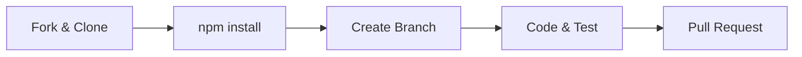
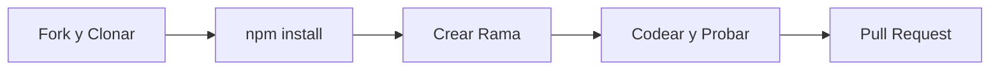

# Contributing to LinkedIn Profile MCP / Contribuir a LinkedIn Profile MCP 🤝

[English](#english) | [Español](#español)

---

## 🇺🇸 English: Contribution Guide

We're excited that you want to contribute! This project aims to be the most robust bridge between Claude and LinkedIn.

### 🛠 Development Workflow

1. **Setup Environment**:
   - Create a `.env` file based on `.env.example`.
   - Run `npm install`.
2. **Verification**:
   - Ensure all tests pass: `npm run test`.
   - Verify build: `npm run build`.

### 🚀 Adding New Tools
1. **Logic**: Implement your tool in `src/tools/`. It must return `Promise<ToolResult>`.
2. **Export**: Add the export to `src/tools/index.ts`.
3. **Register**: Add the tool definition and handler in `src/index.ts`.
4. **Docs**: Update `docs/tools-reference.md`.

### 🧠 Enhancing AI Logic
- **Analysis**: Modify `analyze_profile` in `src/tools/ai-assist.ts`.
- **Prompts**: Update templates in `src/prompts/templates.ts`.
- **ATS**: Refine `src/utils/keyword-extractor.ts`.

---

## 🇪🇸 Español: Guía de Contribución

¡Nos emociona que quieras contribuir! Este proyecto aspira a ser el puente más robusto entre Claude y LinkedIn.

### 🛠 Flujo de Desarrollo

1. **Configuración**:
   - Crea un archivo `.env` basado en `.env.example`.
   - Ejecuta `npm install`.
2. **Verificación**:
   - Asegúrate de que los tests pasen: `npm run test`.
   - Verifica la compilación: `npm run build`.

### 🚀 Añadir Nuevas Herramientas
1. **Lógica**: Implementa tu herramienta en `src/tools/`. Debe retornar `Promise<ToolResult>`.
2. **Exportación**: Añade el export en `src/tools/index.ts`.
3. **Registro**: Añade la definición y el handler en `src/index.ts`.
4. **Documentación**: Actualiza `docs/tools-reference.md`.

### 🧠 Mejorar la Lógica de IA
- **Análisis**: Modifica `analyze_profile` en `src/tools/ai-assist.ts`.
- **Prompts**: Actualiza las plantillas en `src/prompts/templates.ts`.
- **ATS**: Refina `src/utils/keyword-extractor.ts`.

---

## 💎 Code Standards / Estándares de Código
- **TypeScript**: Always use explicit types. / Usa siempre tipos explícitos.
- **JSDoc**: Document all public functions. / Documenta todas las funciones públicas.
- **Tests**: PRs without tests will not be accepted. / No se aceptarán PRs sin pruebas.
