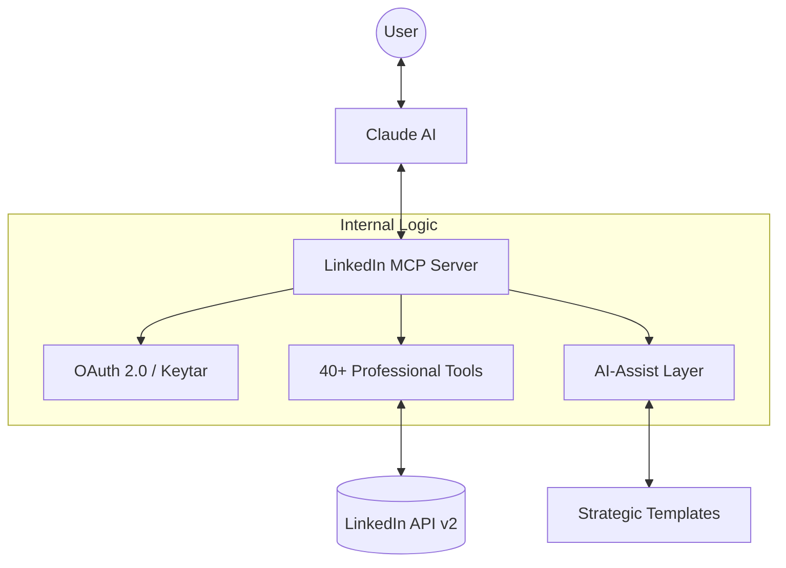
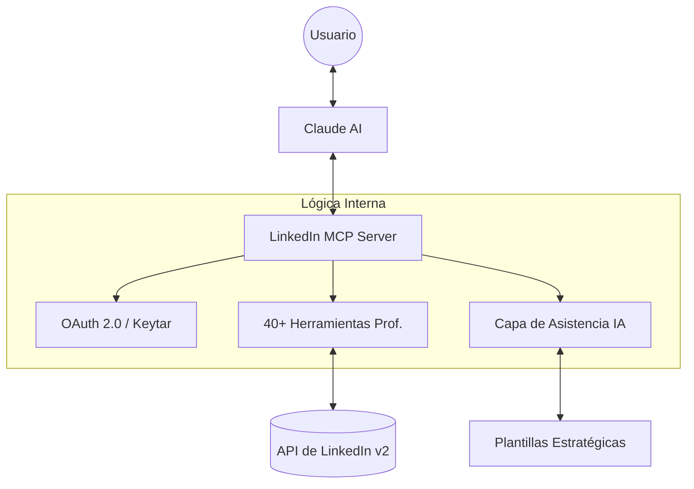

# LinkedIn Profile MCP Server 🚀

  
  
  
  

  <b>Bilingual Documentation / Documentación Bilingüe</b> 
  <a href="#english">English</a> • <a href="#español">Español</a>

---

## 🇺🇸 English Version

An intelligent bridge between **Claude** and **LinkedIn**. This MCP server empowers Claude to act as your high-level career consultant, capable of auditing your profile, optimizing your identity, and managing your professional content with real-time API access.

### 🏗 Architecture Overview

### ✨ Key Features
- **Impact Audit**: Data-driven analysis of your profile's effectiveness.
- **Identity Control**: Precision updates for headlines and summaries.
- **Content Engine**: Direct posting of updates and articles.
- **Smart ATS**: Match your profile against specific job descriptions.
- **Security Hub**: Mandatory diff previews and encrypted token storage.

### 🚀 Quick Start

| Step | Action | Command |
| :--- | :--- | :--- |
| 1 | Clone | `git clone https://github.com/Thejosem4/linkedin-profile-mcp.git` |
| 2 | Install | `npm install` |
| 3 | Config | `cp .env.example .env` |
| 4 | Build | `npm run build` |
| 5 | Start | `npm start` |

---

## 🇪🇸 Versión en Español

Un puente inteligente entre **Claude** y **LinkedIn**. Este servidor MCP permite que Claude actúe como tu consultor de carrera de alto nivel, capaz de auditar tu perfil, optimizar tu identidad y gestionar tu contenido profesional con acceso en tiempo real a la API.

### 🏗 Vista General de la Arquitectura

### ✨ Características Principales
- **Auditoría de Impacto**: Análisis basado en datos sobre la efectividad de tu perfil.
- **Control de Identidad**: Actualizaciones de precisión para titulares y extractos.
- **Motor de Contenido**: Publicación directa de actualizaciones y artículos.
- **ATS Inteligente**: Compara tu perfil contra descripciones de empleo específicas.
- **Hub de Seguridad**: Previsualización de cambios obligatoria y almacenamiento cifrado.

### 🚀 Inicio Rápido

| Paso | Acción | Comando |
| :--- | :--- | :--- |
| 1 | Clonar | `git clone https://github.com/Thejosem4/linkedin-profile-mcp.git` |
| 2 | Instalar | `npm install` |
| 3 | Configurar | `cp .env.example .env` |
| 4 | Compilar | `npm run build` |
| 5 | Iniciar | `npm start` |

---

## ⚙️ Configuration / Configuración (.env)

Detailed guide available in the [Setup Guide](docs/setup-oauth.md).
Guía detallada disponible en la [Guía de Configuración](docs/setup-oauth.md).

## 📚 Resources / Recursos
- [Tools Reference / Referencia de Herramientas](docs/tools-reference.md)
- [Contributing / Contribuir](CONTRIBUTING.md)
- [Changelog / Historial de Cambios](CHANGELOG.md)

## 📄 License / Licencia
MIT License © 2026 Thejosem4
