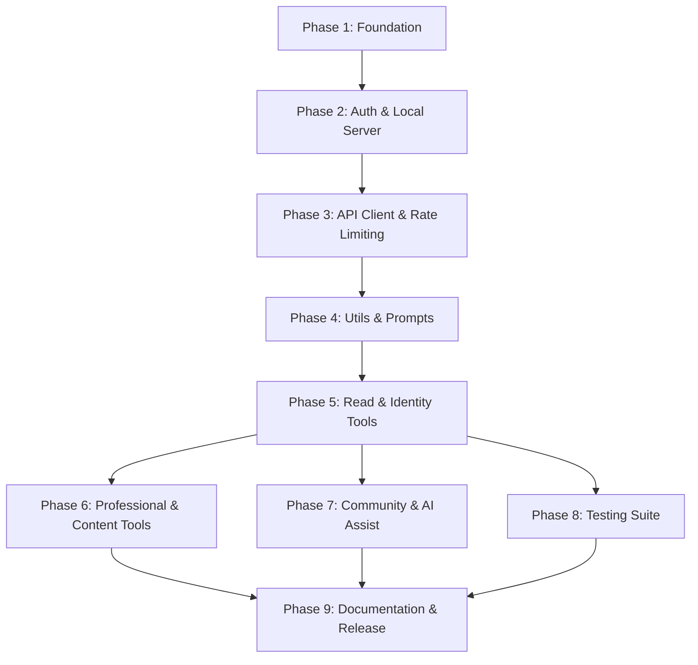

# Implementation Plan: LinkedIn Profile MCP

## 1. Plan Overview
- **Total Phases**: 9
- **Agents Involved**: Architect, API_Designer, Coder, Tester, Technical_Writer, Code_Reviewer
- **Estimated Effort**: High (Complex, Multi-Phase)

## 2. Dependency Graph

## 3. Execution Strategy Table

| Stage | Phases | Execution Mode | Agent(s) |
|-------|--------|----------------|----------|
| 1 | 1 | Sequential | `coder` |
| 2 | 2 | Sequential | `coder` |
| 3 | 3 | Sequential | `coder` |
| 4 | 4 | Sequential | `coder` |
| 5 | 5 | Sequential | `coder` |
| 6 | 6, 7, 8 | Parallel | `coder`, `tester` |
| 7 | 9 | Sequential | `technical_writer` |

## 4. Phase Details

### Phase 1: Foundation (Layer 1)
- **Objective**: Establish the project foundation and shared types.
- **Agent**: `coder` — *Expert in system design and project scaffolding*.
- **Files to Create**:
  - `package.json`: Core dependencies (MCP SDK, TypeScript, keytar, bottleneck).
  - `tsconfig.json`: Strict NodeNext configuration.
  - `src/types.ts`: Global `LinkedInProfile`, `UserContext`, `DiffPreview`.
  - `src/config.ts`: Zod-validated environment config.
- **Validation**: `npm run build` (empty project).

### Phase 2: Auth Module & Local Server (Layer 2)
- **Objective**: Secure authentication and token management.
- **Agent**: `coder` — *Specialist in OAuth flows and local port handling*.
- **Files to Create**:
  - `src/auth/oauth.ts`: `generateAuthUrl`, `handleCallback`, `refreshToken`.
  - `src/auth/token-store.ts`: `keytar` storage with file fallback.
  - `src/auth/scopes.ts`: Required scopes list.
- **Validation**: Manual OAuth flow test with a real LinkedIn app.

### Phase 3: API Client & Rate Limiting (Layer 3)
- **Objective**: Robust API communication and quota enforcement.
- **Agent**: `coder` — *Expert in HTTP clients and rate limiting*.
- **Files to Create**:
  - `src/api/client.ts`: Axios singleton with Bearer token interceptor.
  - `src/api/rate-limiter.ts`: `bottleneck` wrapper for 100 req/day limit.
  - `src/api/endpoints.ts`: LinkedIn v2 REST endpoints.
  - `src/api/profile-cache.ts`: 5-min memory cache for profile data.
- **Validation**: API mock response tests for 429 and token refresh.

### Phase 4: Core Utils & Prompt System (Layer 4)
- **Objective**: Core utilities and AI prompt logic.
- **Agent**: `coder` — *Expert in logic and implementation*.
- **Files to Create**:
  - `src/utils/diff.ts`: Visual diff generation between old/new content.
  - `src/utils/char-counter.ts`: LinkedIn character limit validation.
  - `src/prompts/system.ts`: Global role and quality rules.
  - `src/prompts/templates.ts`: Per-tool instruction templates.
- **Validation**: Unit tests for diff generator and char counter.

### Phase 5: Read Tools & Identity Tools (Layer 5)
- **Objective**: Basic profile reading and identity management.
- **Agent**: `coder` — *Expert in feature implementation*.
- **Files to Create**:
  - `src/tools/read.ts`: `get_profile`, `get_analytics`.
  - `src/tools/write-identity.ts`: `update_headline`, `update_summary`.
- **Validation**: End-to-end tool calls using Claude (mocked).

### Phase 6: Professional & Content Tools (Layer 5, Parallel)
- **Objective**: Full professional history and content posting.
- **Agent**: `coder`.
- **Files to Create**:
  - `src/tools/write-experience.ts`, `src/tools/write-credentials.ts`.
  - `src/tools/write-projects.ts`, `src/tools/write-content.ts`.
- **Validation**: Schema validation and character limit checks.

### Phase 7: Community, Enrichment & AI Assist (Layer 5, Parallel)
- **Objective**: Advanced optimization and community tools.
- **Agent**: `coder`.
- **Files to Create**:
  - `src/tools/write-community.ts`, `src/tools/write-enrichment.ts`.
  - `src/tools/ai-assist.ts`: `analyze_profile`, `ats_optimize`.
- **Validation**: Diagnostic output quality check.

### Phase 8: Testing Suite (Layer 5, Parallel)
- **Objective**: Validation and quality assurance.
- **Agent**: `tester` — *Specialist in unit and integration testing*.
- **Files to Create**:
  - `tests/fixtures/*.json`: Mock API data.
  - `tests/**/*.test.ts`: Complete coverage for tools and API client.
- **Validation**: `npm run test` (aiming for 70%+ coverage).

### Phase 9: Documentation & Release (Layer 6)
- **Objective**: Project documentation and release readiness.
- **Agent**: `technical_writer` — *Expert in clear, accessible documentation*.
- **Files to Create**:
  - `README.md`, `docs/setup-oauth.md`, `docs/tools-reference.md`.
- **Validation**: Link check and installation guide verification.

## 5. File Inventory

| Phase | Path | Purpose |
|-------|------|---------|
| 1 | `package.json` | Project metadata and dependencies |
| 1 | `tsconfig.json` | TypeScript configuration |
| 1 | `src/types.ts` | Shared domain types |
| 1 | `src/config.ts` | App configuration |
| 2 | `src/auth/oauth.ts` | Auth logic |
| 2 | `src/auth/token-store.ts` | Storage |
| 3 | `src/api/client.ts` | API client |
| 4 | `src/utils/diff.ts` | Diff utility |
| 4 | `src/prompts/system.ts` | Global prompt |
| 5 | `src/tools/read.ts` | Read tools |
| 5 | `src/tools/write-identity.ts` | Identity tools |
| ... | ... | ... |

## 6. Cost Estimation

| Phase | Agent | Model | Est. Input | Est. Output | Est. Cost |
|-------|-------|-------|-----------|------------|----------|
| 1 | architect | pro | 5K | 1K | $0.09 |
| 2 | api_designer| pro | 8K | 2K | $0.16 |
| 3 | api_designer| pro | 8K | 2K | $0.16 |
| 4 | coder | pro | 10K | 3K | $0.22 |
| 5 | coder | pro | 12K | 4K | $0.28 |
| 6 | coder | pro | 15K | 5K | $0.35 |
| 7 | coder | pro | 15K | 5K | $0.35 |
| 8 | tester | flash | 20K | 8K | $0.05 |
| 9 | technical_writer| flash | 10K | 4K | $0.03 |
| **Total** | | | **103K** | **34K** | **$1.69** |

*Estimate includes a 50% retry buffer.*

## 7. Execution Profile
- Total phases: 9
- Parallelizable phases: 3 (in 1 batch)
- Sequential-only phases: 6
- Estimated parallel wall time: ~4-6 hours (manual review)
- Estimated sequential wall time: ~8-10 hours

Note: Native parallel execution currently runs agents in autonomous mode.
All tool calls are auto-approved without user confirmation.
